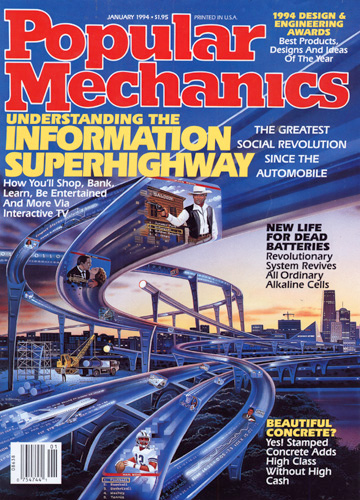
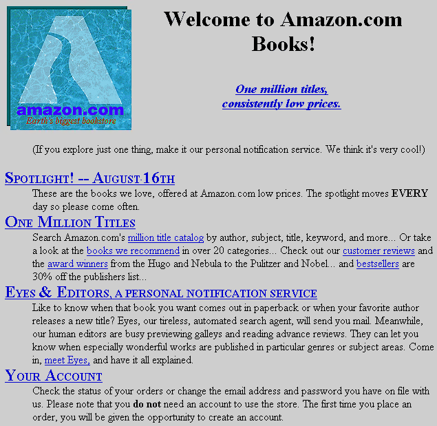
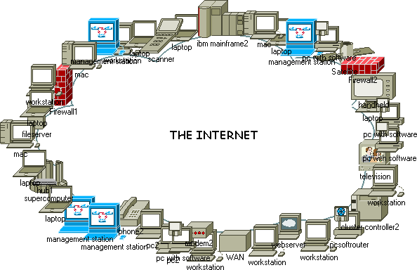
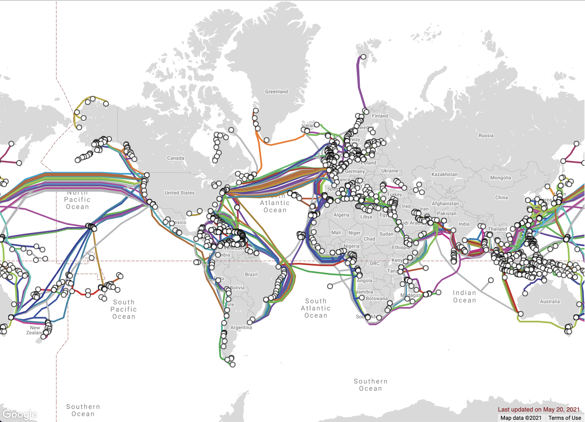
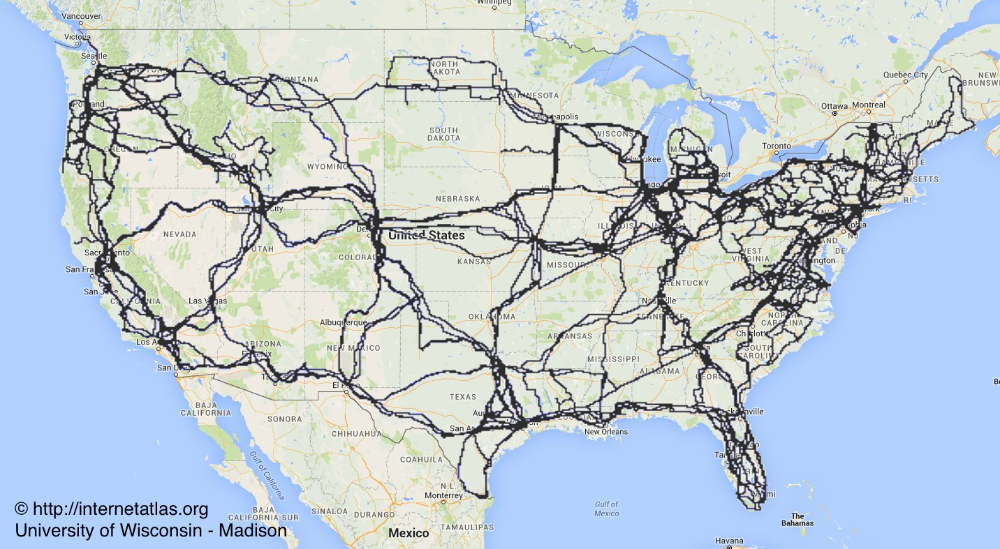
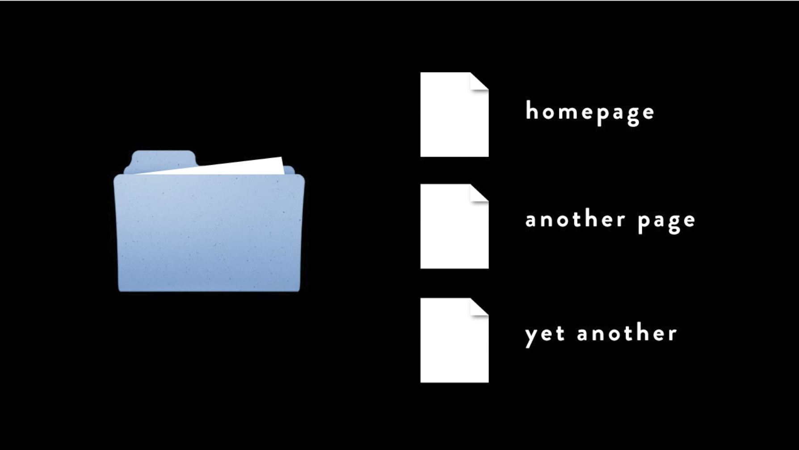
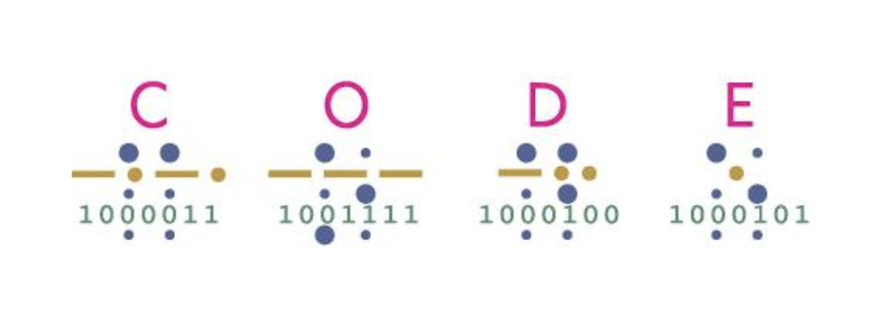
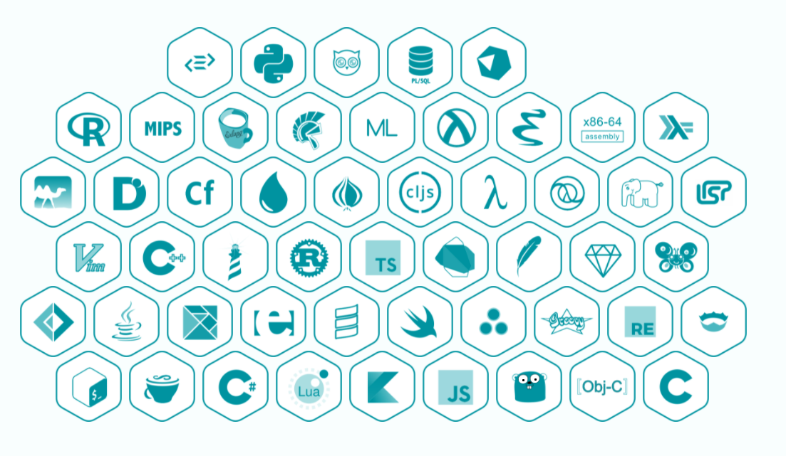
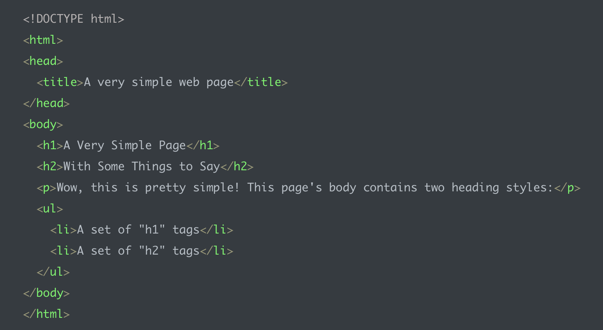

autoscale: true

# What Even Is Web Development?

I. The Internet, Computers, and Code
II. Making a webpage with HTML and CSS
III. Making a webpage even better with more HTML and CSS

---

# I. The Internet, Computers, and Code

- What is the internet?
- What is a website (like, really)?
- What if I want to make a website?

---

# Perspective 🧐

- Every question is important
- Coding is a team sport
- Tech is fun

---

# What Even Is THE INTERNET??

# 🤔 🤔 🤔

---

## In the early days we thought it was this

---

## 1995

---

## (no)

---

## kind of?

---

## billions of computers

---

---

## "servers"

---

[^*]: By The Opte Project - Originally from the English Wikipedia; CC BY 2.5, https://commons.wikimedia.org/w/index.php?curid=25698718

---

### 🦑 underwater cables! 🦈

---

^ in the US

---

^ Let's look at this global map again. Those dots are data centers.

---

## servers, and services, are provided by companies you've probably heard of

---

# What does a server serve?

---

## What is a website?

---

# We need to talk about

---

> "A computer is a clock with benefits"
> -- Paul Ford

---

# Anything a computer does, YOU can do with a pencil and paper.

It might just take you a really really (REALLY) long time.

---

# Binary

---

---

## Code is for machines + humans 🤖

programming lang -> machine lang -> bytes & bits -> hardware

---

## Why do we have so many programming languages?

---

---

^ source: [https://reinvently.com/blog/fundamentals-web-application-architecture/]

---

# Who writes code?

- web developer
- software developer
- software engineer
- ANYONE WHO FEELS LIKE IT

---

# HTML!

^ look at pages in firefox

---

# HTML Tags

- headers
- subheaders
- images
- paragraphs
- lists
- links

---

---

# Let's make a page!

---

### www.glitch.com

^ https://glitch.com/edit/#!/tiny-web-page

---

## Make a page about you.

1. Make a heading with your name.
2. Make a paragraph (write something interesting, like how to write your name in binary code... 😉).
3. Make an image element using the `img` tag. (Find an image you want to use in the `assets` folder. Click the copy button. That is what you will use as the `src` attribute for your link element.)
4. Add anything else you want to add!

---

## Next week: HTML + CSS

