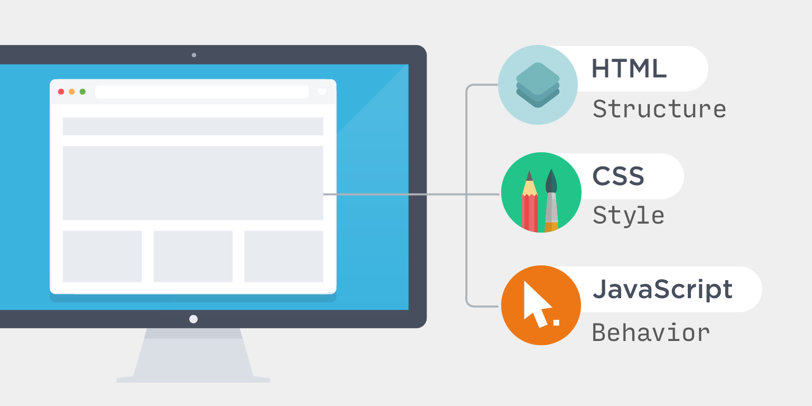
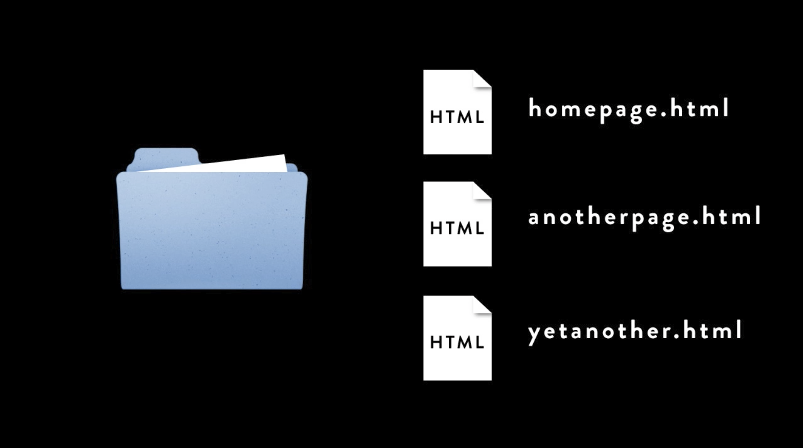

autoscale: true

# What Even Is Web Development?

I. The Internet, Computers, and Code
II. Making a webpage with HTML and CSS
III. Making a webpage even better with more HTML and CSS

---

# II. Making a webpage with HTML and CSS

- What all do you need to do to make a webpage?
- Using HTML to put content on a page
- Using CSS to make that content look the way you want

---

# Perspective 🧐

- Every question is important
- Coding is a team sport
- Tech is fun

---

# What Even Is HTML??

# 🤔 🤔 🤔

---



^ Web pages are made up of **content** (the words and images you see), **styling** (the layout and design), and **interactivity** (the ability to click, drag, and manipulate things on the page).

---

# HTML!



^ look at pages in firefox

---

# Structure is HTML's job

When you write HTML,
you are giving instructions to the browser
about the content that goes on the page.

- _text_
- _images_
- _audio files_
- _and more!_

---

# Tags "mark up" the content of the page

[.column]

- header and footer
- sections
- text headings
- body text

[.column]

- images
- links
- form inputs and buttons
- items in a list

---


---

```html
<h1>Hello, World!</h1>
```

---

```html
<!DOCTYPE html>
<html>
  <head>
    <title>BlueRibbon Cattle Farms</title>
  </head>
  <body>
    <h1>Charolais Cows</h1>
    <p>These beautiful cows are an ancient breed from France.</p>
  </body>
</html>
```

---

### There can be only one `<body>` tag

Inside the `<body>` tag is where you put the main content of the page.

---

# [fit] Tag Tour!

^ What follows is a list of some of the elements you could use to create a page.

---

## Tags to Make Sure the Page Works in a Browser

```html
<!DOCTYPE html>
<html lang="en">
  <head></head>
  <body></body>
</html>
```

---

## Tags to Display Content

Content goes inside the `<body></body>` tags.

---

# `<p></p>`

Use this to create a **paragraph** element, when you want to display text on the page.

```html
<p>Lorem ipsum dolor sit amet, consectetur adipiscing elit.</p>
```

---

# `<h1></h1>`

Use this tag to create a **heading** for a section of content. `h1` refers to a top-level heading.

`h2`, `h3`, `h4`, `h5`, `h6` are also available as tags for more headings and sub-headings. They should be used in order of importance on the page.

```html
<h1>New and Improved!</h1>
<h2>Your favorite toothpaste is mintier than ever!</h2>
```

---

# `<a></a>`

The `a` is for **anchor**. Use this to create a link on the page.

An `a` element has to have an `href` attribute that indicates where the link will navigate to.

The text content inside the opening and closing tags will be the text of the link that shows up on the page.

```html
<a href="https://www.durhamcountylibrary.org/catalog">Search for books</a>
```

---

# `<ul></ul>`, `<ol></ol>`, `<li></li>`

`ul` -> **unordered** (bulleted) list

`ol` -> **ordered** (numbered) list

`li` -> **list item**

```html
<ul>
  <li>lions</li>
  <li>tigers</li>
  <li>bears</li>
</ul>
```

---

# ``

An image element

It does NOT need opening and closing tags.
It DOES need a `src` attribute for the image file.

```html

```

---

## Tags to Organize Content on the Page

Contain other elements to organize page structure

Think of them as containers or wrappers.

---

# `<div></div>`

This tag creates an element that acts as a generic container for a "division" of a page.

```html
<div class="grocery-list">
  <ol>
    <li>cereal</li>
    <li>milk</li>
    <li>blueberries</li>
    <li>bananas</li>
  </ol>
</div>
```

---

# `<section></section>`

This element is used to create a section on the page.

```html
<section class="map">
  <h1>Orange County</h1>
  
</section>
```

---

# `<header></header>`

Organize elements that belong at the top of a page

(things like logos, headings, and navigational links)

```html
<header>
  <nav>
    <ul>
    <li><a href="/accounts/login">Log In</a></li>
    <li><a href="/shop">Shop</a></li>
    <li><a href="/support">Contact Us</a></li>
  </nav>
</header>
```

---

# `<footer></footer>`

Organize content that we're accustomed to seeing at the bottom of a page.

```html
<footer>
  <a href="/about">About Us</a>
  <a href="/blog">Blog</a>
  <a href="/contact">Contact</a>
  <p>© 2021 Acme Co.</p>
</footer>
```

---

There are more, but you can get pretty far with combinations of just these.

---

### www.glitch.com

^ https://glitch.com/edit/#!/what-even-is-html

---

# [fit] What Even Is CSS?

---

## Cascading Style Sheets

CSS is a "style sheet language" that lets you style the elements on your page.

### CSS works in cooperation with HTML!

---

### Connect it to your HTML

Put this tag inside the `head` element on your page

```css
<link href="yourfile.css" rel="stylesheet">
```

---

## selectors

...target HTML elements

## properties

...specify exactly what we want to style and how to style it

---


---

# Tag Selectors

```css
img {
  border: 1px solid silver;
  padding: 5px;
}
```

---

# Class selectors

```css
.pet-photo {
  border: 1px solid silver;
  padding: 5px;
}
```

---

# ID selectors

```css
#featured-pet {
  border: 4px dotted purple;
  padding: 5px;
}
```

---

## some examples

```css
.some-class {
  color: blue;
  width: 30px;
  height: 80%;
  font-style: italic;
  font-weight: bold;
  font-size: 20pt;
  font-family: 'Helvetica Neue', Arial, sans-serif;
  font: italic bold 10px sans-serif;
  background-color: #551a8b;
  text-align: center;
  border: 1px solid black;
}
```

---

## [Google Fonts](https://fonts.google.com/)

Free fonts to change the typography of your site!

---

## 🎨 Colors are fun

- [HTML Color Reference](https://htmlcolorcodes.com/)
- [Coolors!](https://coolors.co/)

---

## [Build a Tribute Page](https://glitch.com/edit/#!/tribute-template)

---
